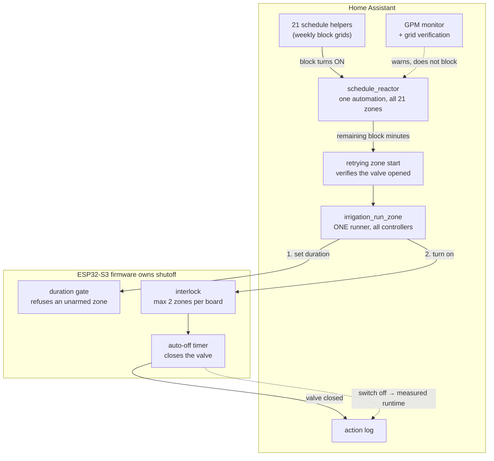

# Home Assistant Irrigation 21 Zones, 4 ESP32 Controllers, One Well Pump, Existing sprinkler system

A complete, in-service sprinkler control system built on Home Assistant and ESPHome.
Four ESP32-S3 relay controllers replace the electronic timers, some approaching 30 years old;
Home Assistant does the scheduling, flow calculation and reporting.


```
21 sprinkler zones  4 ESP32S3 Waveshare controllers 1 shared well pump (approx 20 GPM) provided through max 1 1/4" PVC  from the well.
Pump is 80' deep with 40' of head  Tested to 100 GPM at drilling
```

---

## The idea in one paragraph

Home Assistant **arms** a run; the ESP32 firmware **ends** it. HA writes a duration to the
controller, then opens the valve and that is the last thing it does. The firmware counts
down and closes the valve itself. If Home Assistant crashes, loses Wi-Fi, or is powered off
mid-run, the valve still closes on time. Every other design decision in this repo follows
from that split.

---

## What it does

- **Per-zone weekly scheduling**, where the schedule block *is* the runtime. A block of
  08:00-08:15 waters that zone for 15 minutes. 
- **Flow budgeting against a single well pump.** Every zone has a GPM figure. The system
  shows live total draw, warns when the *programmed* weekly grid would exceed the pump, and
  refuses to start a manual multi-zone run that would go over GPM limit.
- **Three layers of shutoff safety, all of them in firmware** and independent of HA. Home
  Assistant holds no timeout and no failsafe — it closes a valve only when you press Stop.
- **An action log that records what actually happened** runtimes computed from the
  valve's own state timestamps, so manual toggles, interrupted runs and firmware refusals
  all show up, not just what was commanded.
- **A dashboard** with a property zone map, per-zone controls, a weekly pattern grid, and
  one global stop.

## What it deliberately does not do

- **No weather awareness.** No rain delay, no ET adjustment, no forecast skip. Everything
  is calendar-driven. 
- **No flow or pressure sensing.** GPM figures are hand-entered estimates. The system
  does not track what actually flowed. A stuck valve or dead pump are not part of this automation.
- **It does not stop a scheduled run that exceeds the pump budget.** These are checked at scheduling time.

---

## Architecture



**One generic reactor covers all 21 zones**, and **one generic runner covers all four
controllers.** Zones are wired to their Waveshare switch, enable toggle, master toggle and duration
through lookup maps. 

---

## Repository layout

```
homeassistant/
  packages/
    irrigation_zone_engine.yaml   THE zone registry + all 6 generic scripts
    irrigation_east.yaml          } per-controller HELPERS only
    irrigation_garden.yaml        } (booleans, durations, timers, status)
    irrigation_west1.yaml         }
    irrigation_west2.yaml         }
    scheduling_core.yaml          the reactor, retry logic, grid verification
    irrigation_gpm_monitor.yaml   flow sensors, pump-limit warning
    irrigation_action_log.yaml    rolling run history
  dashboards/irrigation.yaml    6-view dashboard
  command_line_scripts/
    irrigation_schedule_days.py  reads the weekly grid HA won't expose
esphome/
  irrigation-east.yaml          } four 6-channel relay controllers
  irrigation-west1-controller.yaml
  irrigation-west2-controller.yaml
  irrigation_garden_controller.yaml
  secrets.yaml.example
docs/
  SYSTEM.md                     full reference — every entity, every call path
  HARDWARE.md                   boards, wiring, GPIO map
  ADAPTING.md                   how to fit this to your own property
```

---

## Four ideas worth using even if you don't use the rest

### 1. The schedule block *is* the runtime

Most irrigation setups store "start at 08:00" and "run for 15 minutes" separately, then
make you edit both. Here the weekly grid's block length is read directly:

```yaml
run_min: >-
  
  {{ (((ev | as_datetime - now()).total_seconds() / 60) | round(0, 'ceil') | int) if ev else 0 }}
```

One intent, one edit. It also means a mid-block Home Assistant restart resumes the zone for
the *remaining* time rather than restarting the full duration.

### 2. Firmware is the single source of shutoff truth — and its timer is restartable

Every zone switch gates on two conditions, then hands the countdown to a script:

```yaml
on_turn_on:
  - if:
      condition:                      # max 2 zones on this board
        lambda: 'return others >= 2;'
      then:
        - switch.turn_off: zone1      # rejected, pulses on-off
      else:
        - if:
            condition:                # refuse a zone HA hasn't armed
              lambda: 'return id(zone1_duration).state <= 0;'
            then:
              - switch.turn_off: zone1
            else:
              - script.execute: zone1_autooff
```

The countdown itself lives in a `mode: restart` script, re-triggered whenever the duration
number changes while the valve is open:

```yaml
script:
  - id: zone1_autooff
    mode: restart                     # cancels any pending countdown first
    then:
      - delay: !lambda 'return (uint32_t)(id(zone1_duration).state * 60000);'
      - switch.turn_off: zone1
```

That one word, `restart`, is the difference between a timer you can reset and one you
cannot. An inline `delay:` reads the duration **once**, at valve-open, and is deaf to it
afterwards — so re-arming a running zone changed the displayed number and nothing else. It
also left the old deadline armed, free to close a later run early.

Duration numbers are `restore_value: false`, so a rebooted controller comes back with every
valve shut and refuses to reopen until HA re-arms it. All 21 zones share one definition,
`esphome/zone_timer.yaml`, included once per zone — so this logic exists exactly once.

### 3. Wait for the valve to close  never schedule the close

The zone runner used to do `delay: 15 min` then
`switch.turn_off`. The script is `mode: parallel`, so every manual press of "Run Now" armed an
independent shutoff that outlived its own run. Four presses on one zone produced this:

|         | valve ON | valve OFF| closed by |
|---------|----------|----------|-----------|
| press 1 | 15:24:13 | 15:24:21 | stopped by hand |
| press 2 | 15:28:11 | 15:39:13 | **press 1's** delay (15:24:13 + 15:00) |
| press 3 | 15:39:38 | 15:43:11 | **press 2's** delay (15:28:11 + 15:00) |
| press 4 | 15:43:54 | 15:54:38 | **press 3's** delay (15:39:38 + 15:00) |

A 15-minute run measured 10 min 44 s. Every OFF landed exactly 15:00 after an *earlier*
press. The fix is to wait for the valve rather than schedule its close.

The first version of that fix kept a backstop — the same wait, but with a timeout of
`dur_min * 60 + 45` that closed the valve if the firmware hadn't. It looked prudent and it
was the same bug in a costume. The timeout was computed from the duration the run *started*
with, so once the countdown became restartable (idea 2), any mid-run change left it stale:

| | |
|---|---|
| 15:45:07 | valve ON, armed 21 min |
| 15:50:19 | re-armed to 31 min — **firmware** countdown restarts, 1860 s |
| 16:06:52 | = 15:45:07 + 21 min 45 s — **HA's** stale backstop expires |
| 16:06:54 | valve OFF, firmware countdown still reading 867 s |

A 31-minute run measured 22, and HA logged it as a firmware fault. The script is
`mode: parallel`, so the instance that expired belonged to the first press while the run it
closed belonged to the second — the table above, one layer up.

So the backstop is gone entirely, not repaired. The whole of it is now:

```yaml
- wait_template: "{{ is_state(z.switch, 'off') }}"
```

No timeout, no `switch.turn_off` anywhere in the runner. An instance whose run ended early
exits cleanly and leaves nothing behind, and one whose run was extended simply keeps waiting.
The cost is that a firmware which never closes a valve has nothing catching it — accepted,
because every deadline HA held turned out to be a deadline HA could act on wrongly, and both
of them did. If that check is ever wanted it belongs on the chip, where the countdown is.

The original root cause was four hand-maintained copies of the same script that had drifted
apart, which is why there is now exactly one.

### 4. Why nothing blocks at runtime

There is no runtime flow gate. It was removed after it started skipping legitimate zones.

At exact block boundaries  one block ending 22:30:00, the next starting 22:30:00  the two
schedule entities update in arbitrary callback order. The gate sometimes counted the
*ending* zone as still running, computed an over-limit total GPM from a 17-millisecond stale
read, and skipped a zone that should have watered. A gate that skips watering is
worse than brief under-pressure the pump recovers from anyway.

Enforcement moved to **programming time**. A script reads the weekly block config straight
out of `.storage/schedule` (Home Assistant exposes only `next_event` to templates the
block grid isn't queryable at all), sweeps every block boundary for every weekday, and marks
each zone/day:

| Mark | Meaning |
|---|---|
| 🔴 | scheduled that day |
| 🔵 | overlaps another zone |
| ⚠️ | the overlap's combined GPM exceeds the pump |

Yellow triangles appear on the same weekly grid you program in, and an automation raises a
notification listing them. Fix the grid, not the runtime.

The one place that *does* refuse to water is the manual "Run" button, which
prices the whole sequence before opening anything and names every offending zone.

---

## Installation

Requires Home Assistant with packages enabled, the ESPHome add-on, and
[button-card](https://github.com/custom-cards/button-card) from HACS for the dashboard.

1. Copy `homeassistant/packages/*.yaml` to `/config/packages/`, with:
   ```yaml
   homeassistant:
     packages: !include_dir_named packages
   ```
2. Copy `homeassistant/command_line_scripts/` to `/config/command_line_scripts/`.
3. Register the dashboard in `configuration.yaml`:
   ```yaml
   lovelace:
     dashboards:
       irrigation-all:
         mode: yaml
         filename: dashboards/irrigation.yaml
         title: Irrigation
         icon: mdi:water-pump
   ```
4. Flash the ESPHome configs. **Generate your own API keys and passwords first**  every
   credential in this repo is a `REPLACE_WITH_YOUR_OWN_` placeholder. Copy
   `esphome/secrets.yaml.example` to `secrets.yaml` and fill it in.
5. Create the `schedule.*` helpers **through the UI** (Settings  Helpers  Schedule). A
   YAML-defined schedule opens in the weekly editor but its "add block" control is disabled.
6. Reload YAML and confirm the entities appear.

**You will need to change the zone names, entity IDs and GPM figures throughout**  they
describe one specific property. [docs/ADAPTING.md](docs/ADAPTING.md) walks through what to
change and in what order. A zone map is optional but helps me every time I run manually.

---

## Documentation

| Document | What's in it |
|---|---|
| [docs/SYSTEM.md](docs/SYSTEM.md) | The full reference: every entity, every script, all three run paths, the safety model, the pump budget, limits |
| [docs/HARDWARE.md](docs/HARDWARE.md) | Boards, relay wiring, GPIO map, valve types |
| [docs/ADAPTING.md](docs/ADAPTING.md) | Fitting this to a different property |

Every YAML file also carries a full header comment explaining what it owns and why it
works the way it does.

---

## Status and honesty

In service and stable. The design has been through twelve revisions, several of which
exist because an earlier version failed in a specific, documented way the abandoned
controller-level scheduling, the removed runtime flow gate, the interlock retry added after
slow-closing valves caused silent non-watering, the parallel-shutoff bug above. Those
failures are written up in [docs/SYSTEM.md §10](docs/SYSTEM.md), because how a design broke
is more useful than the design.


## License

MIT  see [LICENSE](LICENSE).
